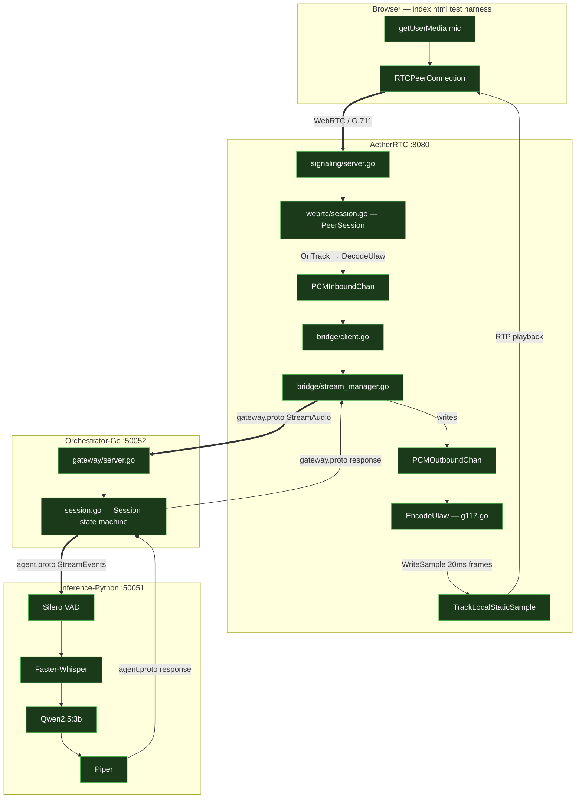

# Voice Agent Runtime - for Hackathon

A distributed, self-hosted voice agent runtime built across a Go orchestrator
and a Python inference engine, connected over a custom gRPC bidirectional
stream. The runtime is designed so that agent behavior — persona, system
prompt, domain — is entirely driven by configuration, not by code.

The same inference pipeline that powers a dental clinic receptionist can
power a real estate consultant or an admissions counselor. Only the YAML
profile changes.

> **Status: Active development.** The full three-tier pipeline (AetherRTC →
> Orchestrator-Go → Inference-Python) is functional and verified end-to-end:
> a real browser microphone, through WebRTC, through the gRPC bridge, through
> VAD/STT/LLM/TTS, with audible response audio playing back in the browser.
> Milestone 6 lifecycle verification and the monitor goroutine for barge-in
> remain as the next milestones.

---

## Why this exists

Self-hosting a voice AI pipeline today usually means either paying for
managed cloud APIs end to end, or stitching together STT, LLM, and TTS tools
with no coherent transport layer, no session model, and no clean separation
between orchestration and inference. This project is an attempt to build
that missing layer — a runtime, not a single-purpose app — that runs
entirely on local hardware with no external API dependencies.

Full architectural reasoning, including why Go for orchestration, why
Python for inference, why gRPC over REST, and the complete session state
machine design, is documented in:

- [`docs/HLD.md`](docs/HLD.md) — High Level Design
- [`docs/LLD.md`](docs/LLD.md) — Low Level Design
- [`docs/true_duplex.md`](docs/true_duplex.md) — True duplex design and
  milestone breakdown
- [`docs/vad.md`](docs/vad.md) — VAD integration design and milestone
  breakdown
- [`docs/three-tier-architecture.md`](docs/three-tier-architecture.md) —
  AetherRTC integration design, proto contracts, and full session lifecycle

---

## Architecture

```text
┌─────────────────────────────────────┐
│         AETHERRTC (Edge Gateway)    │
│                                     │
│  WebRTC termination (Pion)          │
│  G.711/PCMU codec (encode/decode)   │
│  gRPC bridge to orchestrator        │
│                                     │
└──────────────┬──────────────────────┘
               │ gRPC bidirectional stream
               │ gateway.proto (oneof: audio | control)
               ▼
┌─────────────────────────────────────┐
│           GO ORCHESTRATOR           │
│                                     │
│  Session lifecycle, state machine,  │
│  bidirectional duplex streaming,    │
│  gateway.proto ↔ agent.proto relay  │
│                                     │
└──────────────┬──────────────────────┘
               │ gRPC bidirectional stream
               │ agent.proto (oneof: audio | transcript | control)
               ▼
┌─────────────────────────────────────┐
│       PYTHON INFERENCE ENGINE       │
│                                     │
│  Silero VAD (ONNX, boundary detect) │
│  Faster-Whisper (STT, CPU)          │
│  Ollama qwen2.5:3b (LLM, GPU)       │
│  Piper TTS (TTS, CPU)               │
│  Dynamic agent profile injection    │
│  Per-session conversation history   │
│                                     │
└─────────────────────────────────────┘
```

The orchestrator never touches AI models. The inference engine never
manages call lifecycle. AetherRTC never knows what an utterance is.
Each tier is replaceable independently of the others.

### Complete Lifecycle



---

## Companion Project: AetherRTC (Edge Media Gateway)

**[AetherRTC](https://github.com/Adityarya11/aetherRTC)** is a standalone
WebRTC Edge Media Gateway built in Go (using Pion). It is independently
deployable and speaks only `gateway.proto` — it has no knowledge of VAR's
internal AI pipeline. Its sole responsibilities:

- Terminate public WebRTC connections (SDP negotiation, ICE traversal,
  DTLS handshakes, SRTP).
- Force G.711/PCMU at the edge — avoids CGO Opus dependency, enables
  pure-Go audio handling.
- Decode G.711 to raw PCM, forward over `gateway.proto` to the orchestrator.
- Receive PCM response audio from the orchestrator, encode back to G.711,
  write to the browser's outbound RTP track.

The three-tier design ensures VAR remains strictly focused on AI orchestration
and session state. AetherRTC can be pointed at any backend that implements
the `Gateway` gRPC service — it is not coupled to VAR specifically.

---

## Hardware-aware by design

This runtime was built and tested entirely on a consumer laptop — RTX 3050
Mobile (4GB VRAM), Ryzen 5 6600H, 16GB DDR5 — and every component placement
decision reflects that constraint rather than ignoring it.

| Stage | Component             | Device | Footprint       |
| ----- | --------------------- | ------ | --------------- |
| VAD   | Silero VAD (ONNX)     | CPU    | negligible VRAM |
| STT   | Faster-Whisper (int8) | CPU    | negligible VRAM |
| LLM   | qwen2.5:3b via Ollama | GPU    | ~2.2GB VRAM     |
| TTS   | Piper                 | CPU    | negligible VRAM |

Nothing competes for the GPU. Nothing OOMs. The split is deliberate, not
accidental.

---

## What's working today

- [x] gRPC bidirectional stream between Go orchestrator and Python inference engine
- [x] Full STT → LLM → TTS inference pipeline running locally, no external API calls
- [x] Dynamic agent profiling — system prompts flow from YAML configs through the proto contract into the LLM at session start
- [x] Per-session conversation history — LLM maintains context across all utterances within a single call
- [x] Session state machine in Go with mutex-protected, validated transitions, hardened with a `sync.Once` guard against concurrent completion signals
- [x] Token-streaming LLM responses with sentence-boundary chunking — TTS begins synthesizing the first sentence while the LLM is still generating later sentences
- [x] True bidirectional duplex — the gRPC stream stays open across utterance boundaries with no `CloseSend()`, verified with sequential multi-utterance sessions and zero audio bleeding
- [x] VAD-gated utterance boundary detection — a four-state debounce machine over Silero VAD (ONNX) replaces explicit boundary signals, with a lookback buffer and max-duration safeguard, validated against false starts, sustained speech, and cross-utterance state persistence
- [x] AetherRTC three-tier integration — full end-to-end pipeline: browser microphone → WebRTC → AetherRTC → Orchestrator-Go → Inference-Python → TTS response → browser speaker, verified with real browser sessions and audible response audio
- [x] `gateway.proto` contract with sample rate negotiation at `START_SESSION` — AetherRTC declares `source_sample_rate: 8000`, Python's `AudioPreprocessor` resamples accordingly
- [x] G.711 µ-law encode/decode — `DecodeUlaw` (inbound RTP → PCM) and `EncodeUlaw` (PCM → outbound RTP) both implemented and verified
- [x] Outbound audio pacing — 20ms frame reframing with ticker-gated `WriteSample` to prevent RTP bursting to the browser

## What's in progress / next

- [ ] Milestone 6: full lifecycle verification — connect, speak multiple utterances, disconnect cleanly, confirm no goroutine leaks, confirm single `session_id` traces through all three services' logs
- [ ] Monitor goroutine in Orchestrator-Go — context cancellation, session timeout, `InterruptChan` for barge-in support
- [ ] A recorded end-to-end demo

## Deferred (tracked, not forgotten)

- Barge-in (depends on monitor goroutine)
- Jitter buffer and drop-oldest backpressure policy in AetherRTC
- TURN server configuration for real-world NAT traversal (STUN-only today)
- Concurrent ordered utterance processing
- Phase 2: tool calling, RAG, MCP integration (explicitly out of scope until Phase 1 is stable)

---

## Project structure

```text
voice-runtime/
├── proto/
│   ├── agent.proto              # VAR internal contract (audio | transcript | control)
│   └── gateway.proto            # AetherRTC ↔ Orchestrator contract (audio | gateway control)
├── services/
│   ├── orchestrator-go/         # Control plane — session lifecycle, gateway server, gRPC relay
│   └── inference-py/            # Data plane — VAD, STT, LLM, TTS pipeline
├── configs/
│   └── agent_profiles/          # YAML-defined agent personas
├── docs/
│   ├── HLD.md
│   ├── LLD.md
│   ├── true_duplex.md
│   ├── vad.md
│   ├── three-tier-architecture.md
│   └── backlog.md
└── test_data/                   # Sample input/output audio for local testing
```

Service-specific setup and run instructions:

- [`services/orchestrator-go/README.md`](services/orchestrator-go/README.md)
- [`services/inference-py/README.md`](services/inference-py/README.md)

---

## Running the full stack

Start in this order — each service must be up before the next:

```bash
# Terminal 1 — Inference engine
cd services/inference-py
uv run python main.py

# Terminal 2 — Orchestrator-Go gateway server
cd services/orchestrator-go
go run ./cmd/gateway-server -profile receptionist -port :50052 -inference localhost:50051

# Terminal 3 — AetherRTC (separate repo)
go run ./cmd/gateway/main.go

# Browser — open index.html, click Start Call
```

---

## Engineering log

Detailed notes on what was built in each iteration, design tradeoffs made,
and known architectural debt being tracked are kept in
[`docs/backlog.md`](docs/backlog.md). This is the most accurate source of
truth for the current state of the system beyond what's summarized here.
